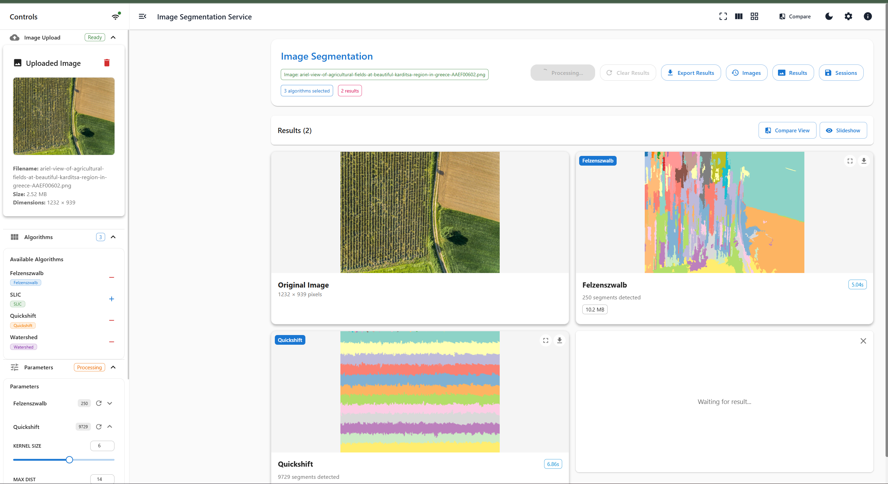
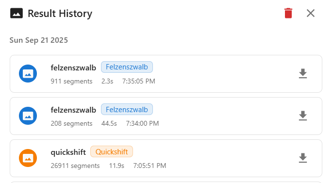
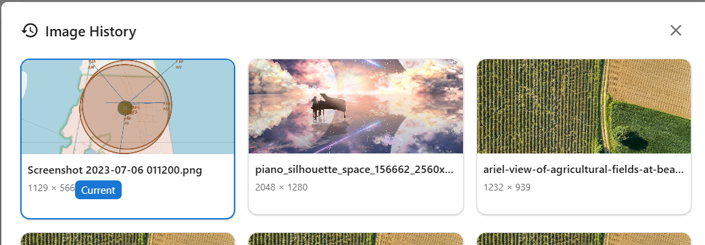

# 🎨 Image Segmentation Service

**Опис:** вебсервіс для сегментації зображень із кількома алгоритмами, налаштуванням параметрів у реальному часі та інтерактивними режимами порівняння.

## ✨ Можливості

### 🔥 Основний функціонал

* **Кілька алгоритмів сегментації**: Felzenszwalb, SLIC, Quickshift, Watershed
* **Налаштування параметрів у реальному часі**: Live-оновлення через WebSocket
* **Режими перегляду**: Single, Split, 2x2 Grid
* **Розумне кешування**: Redis для збереження результатів
* **Метрики продуктивності**: час обробки, використання пам’яті, аналіз сегментів

### 🎯 Розширені можливості 

* **Інтерактивне порівняння**: режим side-by-side та grid view
* 🚫**Пакетна обробка**: сегментація кількох зображень _(в API продумано, на фронті - ні)_
* **Експорт**: PNG, маски, конфігурації параметрів
* **Динамічне керування алгоритмами**: додавання/видалення на льоту
* **Профілювання продуктивності**: детальні метрики по кожному алгоритму

### 🚀 Технічні особливості

* **FastAPI Backend**: сучасний асинхронний фреймворк
* **React Frontend**: TypeScript + Material-UI
* **WebSocket**: live-оновлення
* **Docker**: повна контейнеризація
* **Готовність до мікросервісів**
* **Production-ready**: health-checks, логування, моніторинг

## 🏗️ Архітектура

```
┌─────────────────┐    ┌──────────────────┐    ┌─────────────────┐
│   React UI      │────│   FastAPI        │────│   ML Pipeline   │
│   - Multi-view  │    │   - WebSockets   │    │   - 4 Алгоритми │
│   - Real-time   │    │   - REST API     │    │   - Метрики     │
│   - Інтерактив  │    │   - Валідація    │    │   - Кешування   │
└─────────────────┘    └──────────────────┘    └─────────────────┘
         │                        │                        │
         │                        │                        │
    ┌─────────┐            ┌─────────────┐         ┌──────────────┐
    │Material │            │    Redis    │         │  Image Store │
    │   UI    │            │   Cache     │         │   & Utils    │
    └─────────┘            └─────────────┘         └──────────────┘
```

## 🛠️ Технологічний стек

### Backend

* FastAPI + Pydantic 2.5+
* scikit-image, OpenCV
* Redis (кеш), PostgreSQL (метадані, опційно, тут не за стосовуєтсья)
* WebSockets для оновлень

### Frontend

* React 20+ & TypeScript
* Material-UI (MUI)
* Zustand (state management)
* WebSocket hooks

### DevOps

* Docker + Compose
* Multi-stage builds
* Health checks + моніторинг

## 🚀 Швидкий старт

```bash
git clone <repository-url>
cd image-segmentation-service
cp .env.example .env

docker-compose up --build
```

* **Frontend**: [http://localhost:3000](http://localhost:3000)
* **Backend API**: [http://localhost:8000](http://localhost:8000)
* **Документація API**: [http://localhost:8000/docs](http://localhost:8000/docs)

## 📚 Використання

### Основний сценарій

1. Завантажити зображення (drag & drop)
2. Обрати алгоритми (Felzenszwalb, SLIC, Quickshift, Watershed)
3. Налаштувати параметри через слайдери (live update)
4. Переглядати результати у режимах **Single**, **Split**, **Grid 2x2**
5. Експортувати результати (PNG + JSON метадані)

### Режими перегляду з прикладами

* **Головний UI**
  
* **Порівняння (Split)**
  
* **Grid 2x2 (Результати)**
  
* **Історія**
  

---

## 🎛️ Параметри алгоритмів

**Felzenszwalb**: `scale`, `sigma`, `min_size`
**SLIC**: `n_segments`, `compactness`, `sigma`
**Quickshift**: `kernel_size`, `max_dist`, `ratio`
**Watershed**: `markers`, `compactness`

---

## 📊 API

* Health: `GET /health`, `GET /health/detailed`
* Images: upload, info, list
* Segmentation: list algorithms, segment single/batch
* Results: get by id, history
* WebSockets: live updates

Приклад JSON експорту:

```json
{
  "timestamp": "2025-09-22T00:37:45.903Z",
  "image": {"id": "2980990e-3d35-4b7c-975c-a296ad764fe7","filename": "Screenshot.png","dimensions": [1129,566]},
  "algorithms": [
    {"name":"felzenszwalb","parameters":{"scale":240,"sigma":1.6,"min_size":270}}
  ],
  "results": [
    {"algorithm":"felzenszwalb","segments_count":283,"processing_time":15.73,"result_url":"/uploads/..._felzenszwalb_result.png"},
    {"algorithm":"quickshift","segments_count":1437,"processing_time":49.00,"result_url":"/uploads/..._quickshift_result.png"},
    {"algorithm":"watershed","segments_count":250,"processing_time":1.44,"result_url":"/uploads/..._watershed_result.png"}
  ]
}
```

---

## 🐳 Деплой

* Dev: `docker-compose up --build`


---

---

**🌾  для Kernel Holding S.A.**
